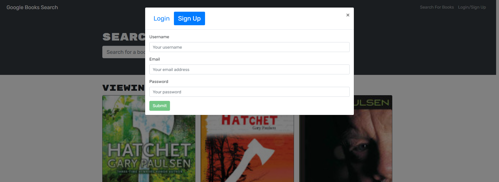

# Book-Search-Engine

Welcome to my first fully working MERN(MongoDB, EXPRESS, REACT.js, NODE) stack project. I have configured to use Graphql API calls.
In this you are able to log in or sign up, search for books , and if you are logged in you will be able to save books to your page to save for later.
I chose these four because I wanted to see how a fully working projects gets stuff done comunicating from the backend to the frontend. The main problem that I struggled with was trying to get the login and the signup working properly.

# Installation 

[https://git.heroku.com/blooming-oasis-11903.git](https://git.heroku.com/blooming-oasis-11903.git)

You can either just click the link above or you can clone the repo itself and run it that way.

If you decide to clone it the following info pertains to you

- Open the terminal and run `npm i`

- The following code above should go in each folder and download all the dependecies that you'll need

- Next you can run `npm run develop`

- That will run the both the backend and the frontend concurrently and that's all you'll need to run the website.

# How to Use 

Of course you are probaly wondering how to even run the website

When you first load up the site you will see this.

You can search up a book by typing your favorite book in the search bar and clicking the submit search button.

By clicking the top right of the screen where it says login or sign up.
It will pop open this model and if you already have an account you can just login.

If you don't already have an account you will have to create one. Don't worry though it's super easy. Just click on the Sign Up button and enter an email, username, and password.

From here you will be logged in and be able to offically save books. You just have to click the Save this Book! button below the description of each book.

# Technologies Used

- MongoDB
- Heroku
- GraphQL
- Express.js
- Node.js
- React.js
- Apollo-Server-Express
- Bcrypt
- JWT-Decode
- Mongoose

# Contact / Questions

Please feel free to contact me @ drewpayton18@gmail.com 

Github: [https://github.com/Drewpayton](https://github.com/Drewpayton)  
LinkedIn: [https://www.linkedin.com/in/drewpayton2018/](https://www.linkedin.com/in/drewpayton2018/)  
Portfolio: [https://drewpayton.github.io/react-portfolio/](https://drewpayton.github.io/react-portfolio/)  

